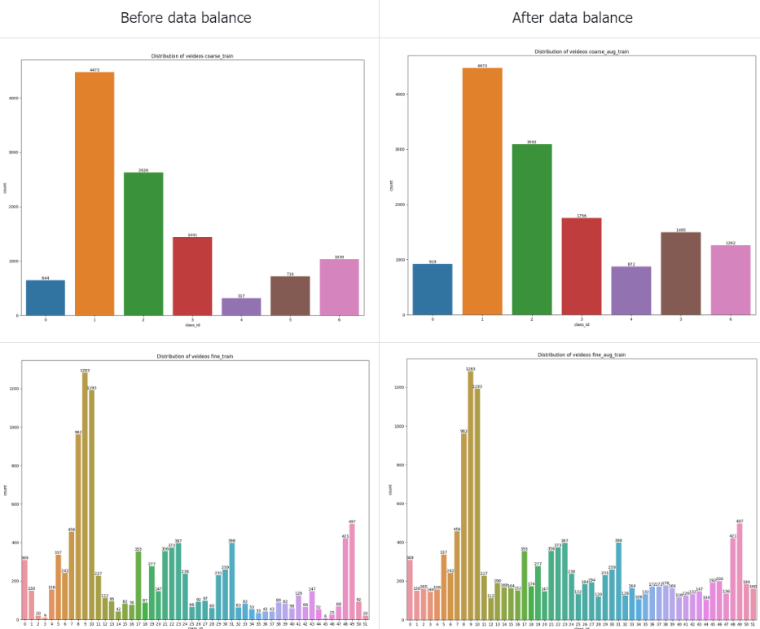
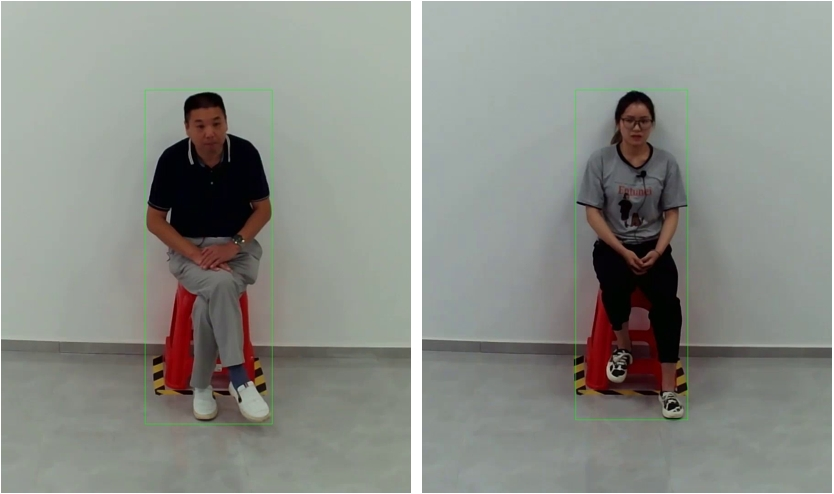

# Solution of 3rd Place for The MAC 2024 Grand Challenge Track 1

## 1. Team member:
Name      |            affiliation            |
---       |            ---                    |
Chen Wang | China Mobile Shanghai ICT Co.,Ltd |
Xun Mei   | China Mobile Shanghai ICT Co.,Ltd |

## 2. Data preparation

- Downlaod Track1 dataset in data or other floder as following:

```
-data
  |-annotations
  |-train
  |-val
  |-test
```

- You need to prepare the virtual environment as follows:

```
conda create --name mmaction
conda activate mmaction
pip install -r requirements.txt
```

### 2.1 Balance data
Those videos less than 100 are copied several times to mitigate the severe data imbalance, which is a commonly used trick.

```
python data/data_aug.py
```

The distribution of train set are visualized before/after **data balance**.



### 2.2 Instance Detection

**Pretrained people detector** is employed to locate the interviewed person. Specifically, the bounding box of person instance is detected by YOLOv8m. All the bounding boxes are saved in pickle format.

```
python data/predict_video.py
```

The bounding box are visualized as follows:



## 3. Training

- Before training your model following our tutorial, please make sure that **the path of instance** is right in line 69 of *mmaction/datasets/video_dataset.py*.

- Make sure **the path of dataset** in config file. 

```
bash tools/dist_train.sh configs/recognition/videomaev2/vit-small-p16_videomaev2-vit-g-dist-k710-pre_16x4x1_ma52.py
```

## 4. Testing Inference

With corresponding configuration, you can inference model forward and save the results in pickle format.

```
bash tools/dist_test.sh configs/recognition/videomaev2/vit-small-p16_videomaev2-vit-g-dist-k710-pre_16x4x1_ma52.py work_dirs/vit-small-p16_videomaev2-vit-g-dist-k710-pre_16x4x1_ma52/best_acc_f1_mean_7053.pth 4 --dump work_dirs/submit/videomaev2_f1mean7053.pickle
```

Notice that we provide several models as well as corresponding pickle files for final submission in the *work_dirs* folder. 

## 5. Submission

If you would like to evaluate a single model, you can run *generate.py* to obtain *submission.py*

```
python generate.py
```

More important, model performance could be improved further by weighting the different predictions via Model ensembling, a simple yet useful trick.

```
python ensemble.py
```

## 6. Tips
Micro-action recognition is a fine-grained classification task. Both of coarse-grained and fine-grained metrics are taken into consideration individually. Therefore, we merge predictions with higher body and action metrics respectively and manually.

For example, we copy the coarse-grained column in *work_dirs/submit/submission7017/prediction.csv* and the fine-grained column in *work_dirs/submit/submission7218/prediction.csv* for our final submission.


